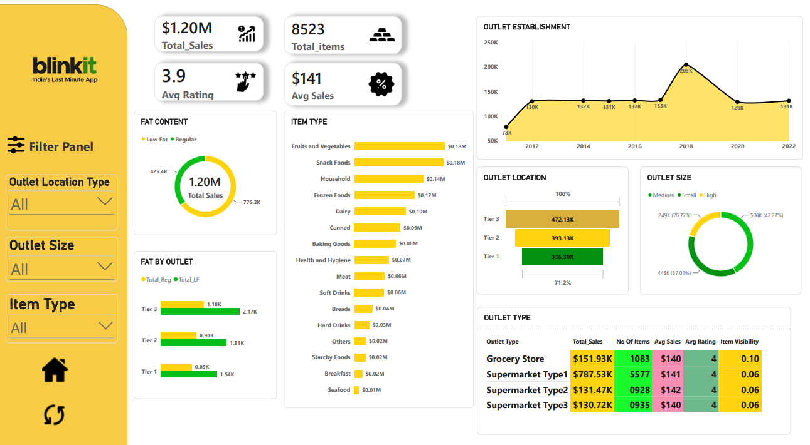

# Blinkit-Analysis
This Power BI dashboard project offers a comprehensive analysis of Blinkit, India's Last Minute App, focusing on sales performance, customer satisfaction, and inventory distribution. The interactive dashboard transforms raw data into actionable insights, enabling data-driven decision-making for business optimization.
This project showcases a detailed Power BI dashboard built to analyze Blinkit's sales performance, customer satisfaction, and inventory distribution. The dashboard delivers key insights and highlights optimization opportunities through various KPIs and visualizations.

# Key Performance Indicators (KPIs)
The dashboard is centered around the following primary KPIs:

Total Sales: Total revenue generated across all items sold ($1.20M)
Average Sales: Average revenue generated per sale ($141)
Number of Items: Total number of distinct items sold (8523)
Average Rating: Average customer rating across items sold (3.9 out of 5)

# Features

Filter Panel: Enables users to filter the data by outlet location type, outlet size, and item type
Outlet Establishment Trend: Tracks the growth of outlet establishments from 2012 to 2022
Fat Content Analysis: Segments sales by low-fat and regular-fat products
Item Type Distribution: Displays sales distribution across different product categories
Outlet Size and Location Analysis: Offers insights into sales performance by outlet size and location tier
Outlet Type Comparison: Compares outlet types based on sales, number of items, average sales, ratings, and item visibility

# Insights and Conclusions

Solid overall sales performance with total sales crossing $1M
A clear consumer preference for low-fat products, reflecting health-conscious buying behavior
Fruits, vegetables, and snack foods emerge as the top-performing categories
Medium-sized outlets in Tier 3 locations demonstrate the highest profitability
Supermarkets drive higher sales volumes, while grocery stores maintain better item visibility

## Dashboard Preview

